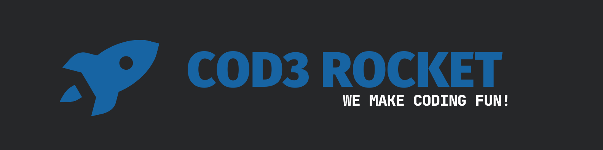

# iTourism

<p align="center">
  
</p>

<h1 align="center">Front-end Hackathon 2022</h1>

<p align="center">
Projeto desenvolvido para o Front-end Hackathon, em parceria com a prefeitura do
município de Bandeirantes-PR e a Universidade Estadual do Norte do Paraná
[UENP](https://uenp.edu.br). O projeto foi desenvolvido voltado ao publico
turístico da região, no site e no aplicativo podemos obter algumas informações
da cidade como: restaurantes, hoteis, bares, locais de lazer, utilidades
públicas, agenda de eventos e pontos turísticos.
</p>

<h3 align="center">
  <!-- Version -->
  <a href="https://github.com/cod3rocket/iTourism/releases">
    
  </a>

 <!-- License -->
  <a href="./LICENSE" target="_blank">
    
  </a>

  <!-- Stars count -->
  <a href="https://github.com/cod3rocket/iTourism/stargazers" target="_blank">
    
  </a>
</h3>

<div align="center">
  
  
  
</div>

# Funcionalidades

- 🚀 Cross-platform (Android, iOS, Web)
- 🌎 Suporte a múltiplas linguagens

# Ferramentas utilizadas

<div style="display: inline_block"><br>

<a href="https://www.typescriptlang.org/" target="_blank">

</a>
<a href="https://dart.dev/" target="_blank">

</a>
<a href="https://flutter.dev/" target="_blank">

</a>
<a href="https://pt-br.reactjs.org/" target="_blank">

</a>
<a href="https://nextjs.org/" target="_blank">

</a>
<a href="https://nestjs.com/" target="_blank">

</a>
<a href="https://www.docker.com/" target="_blank">

</a>
<a href="https://www.postgresql.org/" target="_blank">

</a>
<a href="https://aws.amazon.com/pt/" target="_blank">

</a>
</div>

<br />

# Como contribuir

## Requerimentos

- [docker](https://docs.docker.com/get-docker/) >= 20.10.0
- [docker-compose](https://docs.docker.com/compose/install/) >= 1.29
- [node](https://nodejs.org/en/download/) >= 16.17.0
- [pnpm](https://pnpm.io/installation) >= 7.x
- [just](https://github.com/casey/just#installation)
- [flutter](https://flutter.dev/docs/get-started/install) >= 3.0.0
- [melos](https://melos.invertase.dev/getting-started) >= 2.6.0

## Começando com o código

### 1. Clonar o repositório

```bash
git clone https://github.com/cod3rocket/iTourism.git
```

### 2. Instalar as dependências

```bash
pnpm install
```

### 3. Editar o arquivo .env

```bash
cd apps/api

cp .env.example .env

cd ../..
```

### 4. Executar o script de bootstrap

```bash
pnpm bootstrap
```

### 5. Executar o projeto

```bash
just start
```

### 6. Executar as migrations e popular a database

```bash
cd apps/api

pnpm prisma migrate dev

pnpm prisma db seed
```

## Autores

|[<br><sub>@henriq4</sub>](https://github.com/henriq4) | [<br><sub>@eduardoteles17</sub>](https://github.com/eduardoteles17) |
|-|-|
